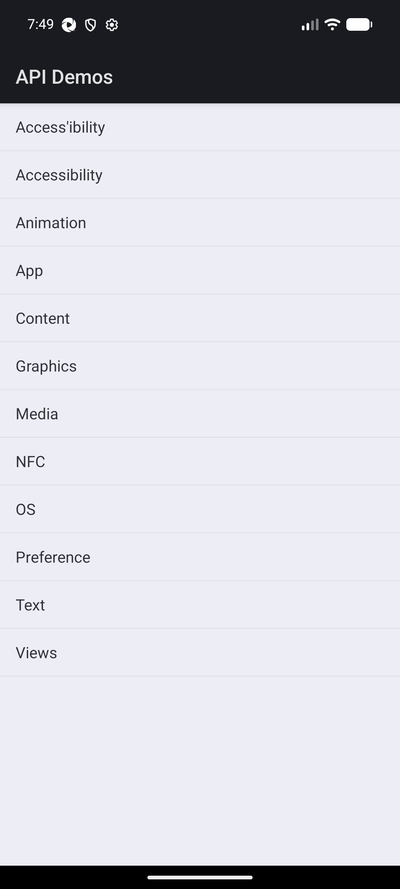
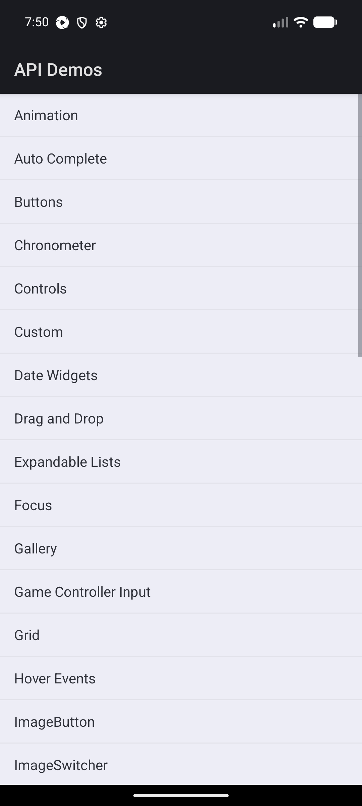
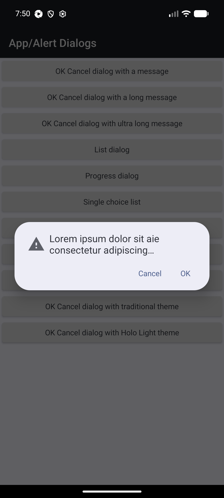

# Appium TypeScript Framework

[](https://github.com/qaabhayraj-cpu/appium-typescript-framework/actions/workflows/mobile-tests.yml)
[](LICENSE)
[](package.json)
[](tsconfig.json)
[](https://appium.io)
[](#test-coverage)

A production-quality, scalable **Android mobile automation framework** built with TypeScript,
WebdriverIO, Appium 2, and UiAutomator2 — driving the [Android ApiDemos](https://github.com/appium/appium)
sample app as the application under test. Built as a Senior QA Automation / SDET portfolio piece
and interview demonstration; not a loose collection of scripts.

**Repository:** https://github.com/qaabhayraj-cpu/appium-typescript-framework

## At a Glance

- **15 automated tests** (6 smoke + 9 regression) covering navigation, forms, checkboxes, radio
  buttons, a date picker, alert dialogs, and gestures — run and verified passing on a real, visible
  Android emulator, not just typechecked.
- **Runs itself, on a schedule.** Every day: smoke at 06:00 IST, full regression at 22:00 IST, plus a
  full run on every push/PR — all via GitHub Actions, no manual trigger needed.
- **Every run produces evidence.** An Allure report every time; screenshots automatically on any
  failure — both downloadable as artifacts from the GitHub Actions run, no local setup required to
  review results.
- **Zero hard-coded paths or secrets.** Fully driven by environment variables (`.env.example`) — the
  same code runs unchanged on a developer laptop, a CI runner, or a client's machine.

### The app under test (ApiDemos on a live emulator)

<table>
<tr>
<td align="center"><br/><sub>Home</sub></td>
<td align="center"><br/><sub>Views submenu</sub></td>
<td align="center"><br/><sub>Alert dialog (Test 7)</sub></td>
</tr>
</table>

### See it running

- **Latest CI run:** [Actions → Mobile Tests](https://github.com/qaabhayraj-cpu/appium-typescript-framework/actions/workflows/mobile-tests.yml)
- **Full report from any run:** open that run → scroll to _Artifacts_ → download `allure-report` →
  open `index.html` locally (Allure reports are static HTML, no server needed to view them)
- **Run it live, on screen:** see [Local Execution](#local-execution) below — `npm run test:smoke:local`
  boots a visible emulator window and drives the app in real time

## Project Overview

The framework exercises a representative slice of native Android interactions — app launch,
navigation, text input, checkboxes, radio buttons, a date picker, alert dialogs, scrolling, swiping,
and long-press gestures — through a proper Page Object Model, centralized wait/gesture/screenshot
utilities, environment-driven configuration, Allure reporting, and a CI pipeline that boots a real
Android emulator on GitHub Actions.

## Architecture

```text
Test Specs (Mocha + Chai)
        ↓
   Page Objects  (HomePage, ViewsPage, TextFieldsPage, DateWidgetsPage, DialogsPage)
        ↓
    BasePage      (click, getText, setValue, waits, scrolling, screenshots)
        ↓
    WebdriverIO    (browser / element API)
        ↓
     Appium 2      (WebDriver protocol server)
        ↓
   UiAutomator2    (Android automation driver)
        ↓
  Android Emulator (ApiDemos app under test)
```

Supporting layers used throughout the stack above:

- **`src/config`** — environment resolution (`environment.ts`) and Appium capability building
  (`capabilities.ts`), entirely driven by environment variables — no machine-specific paths.
- **`src/utils`** — `WaitUtils` (condition-based waits, no `browser.pause()`), `GestureUtils`
  (swipe/long-press/drag-and-drop/scroll via Appium's modern `mobile:` gesture commands),
  `ScreenshotUtils` (named capture + Allure attachment), `FileUtils`, `Logger`.
- **`test/data`** — test data kept out of the specs (`testData.json`), typed via
  `src/types/framework.types.ts`.

## Project Structure

```text
appium-typescript-framework/
├── src/
│   ├── config/            environment.ts, capabilities.ts
│   ├── constants/          appConstants.ts
│   ├── pages/               BasePage, HomePage, ViewsPage, TextFieldsPage, DateWidgetsPage, DialogsPage
│   ├── utils/                WaitUtils, GestureUtils, ScreenshotUtils, FileUtils, Logger
│   └── types/                 framework.types.ts
├── test/
│   ├── specs/
│   │   ├── smoke/             smoke.spec.ts — 6 fast critical-path checks
│   │   └── regression/        regression.spec.ts — 9 deeper/edge-case checks
│   └── data/                 testData.json
├── config/
│   ├── wdio.android.conf.ts  base config (assumes Appium already running — used in CI)
│   └── wdio.local.conf.ts    extends the base config, auto-starts Appium locally
├── .github/workflows/mobile-tests.yml
├── apps/                     ApiDemos-debug.apk (downloaded, not committed — see below)
├── reports/ · screenshots/ · logs/  (git-ignored output directories)
├── .mcp.json                  optional AI-assisted MCP integration (see below)
└── ...
```

> **Note on `ViewsPage`:** ApiDemos models Controls → "1. Light Theme" (Button/CheckBox) and
> "Radio Group" as their own trivial single-purpose activities. Giving each a dedicated Page Object
> would add indirection without benefit, so `ViewsPage` owns navigation through the whole "Views"
> family plus those widget interactions — a deliberate, documented simplification, not an oversight.

## Technology Stack

TypeScript · WebdriverIO 9 · Appium 2 · UiAutomator2 · Mocha · Chai 5 · npm · ESLint 9 (flat config) ·
Prettier · GitHub Actions · Allure Reporting.

### Version notes

- **UiAutomator2 driver is pinned to `4.2.9`.** As of this writing, `appium-uiautomator2-driver@5.0.0+`
  requires **Appium 3**, which is no longer compatible with the Appium 2 stack this framework targets.
  `4.2.9` is the last release whose peer dependency is `appium ^2.4.1`. Installing the driver without a
  version (`appium driver install uiautomator2`) will pull an Appium‑3‑only build and fail to load.
- **The driver ships as a regular `package.json` devDependency**, not a separate install step. Appium
  2's project-local driver management records an installed driver there automatically, so `npm ci`/
  `npm install` alone restores it on any machine or CI runner — that's what both the workflow and a
  fresh clone rely on. `npm run appium:install-driver` still exists as a convenience, but it's
  idempotent: it checks `appium driver list --installed --json` first and only installs if the driver
  is genuinely missing, since running `appium driver install` when it's already present fails with
  "already installed" rather than silently succeeding.
- To move this framework onto Appium 3 later, bump `appium` and drop the `@4.2.9` pin — no other code
  changes are required, since nothing here touches deprecated Appium 1 (`TouchAction`/JSONWP) APIs.

## AI-Assisted Automation (MCP)

This project ships `.mcp.json`, registering [`@wdio/mcp`](https://github.com/webdriverio/mcp) — the
official WebdriverIO Model Context Protocol server. It lets an MCP-aware AI assistant (Claude Code,
Claude Desktop, etc.) drive a live WebdriverIO/Appium session against the emulator directly: useful for
interactively exploring ApiDemos screens, discovering locators, or debugging a flaky step, as a
complement to the static Mocha suite (not a replacement for it). It connects to the same Appium server
started by `npm run appium:start`. No extra setup is needed — any MCP client configured to read this
repo's `.mcp.json` will pick it up automatically.

## Prerequisites

- **Node.js** ≥ 18.20 (LTS 20/22 recommended) and npm
- **Java** (JDK 17) — required by the Android SDK tooling
- **Android Studio** or the standalone **Android SDK** (cmdline-tools, platform-tools, an emulator
  system image)
- **ADB** on your `PATH` (bundled with the Android SDK's `platform-tools`)
- A running **Android Emulator** (AVD) or a physical device with USB debugging enabled
- **Appium 2** — installed as a project devDependency, no global install required

## Installation

```bash
git clone https://github.com/qaabhayraj-cpu/appium-typescript-framework.git
cd appium-typescript-framework
npm install

# Install the Appium UiAutomator2 driver (pinned for Appium 2 compatibility)
npm run appium:install-driver

# Download the ApiDemos APK into apps/ (or copy your own build to that path)
mkdir -p apps
curl -fL -o apps/ApiDemos-debug.apk \
  https://github.com/appium/appium/raw/1.x/sample-code/apps/ApiDemos-debug.apk

# Copy the env template and adjust for your machine (device name, platform version, ...)
cp .env.example .env
```

`.env` is git-ignored — it's where machine-specific values (emulator name, API level, Appium port)
belong. Nothing in the source tree hard-codes a local path; see `src/config/environment.ts`.

## Local Execution

1. **Start an emulator** (or plug in a device with `adb devices` showing it):
   ```bash
   emulator -avd <your_avd_name>
   ```
2. **Run the tests.** `npm run test:local` starts Appium for you automatically
   (via `@wdio/appium-service`) and tears it down after the run:
   ```bash
   npm run test:local              # full suite (smoke + regression)
   npm run test:smoke:local        # smoke only
   npm run test:regression:local   # regression only
   ```
   If you'd rather manage the Appium server yourself (e.g. to watch its logs live), start it in one
   terminal and run against it in another:
   ```bash
   npm run appium:start        # terminal 1
   npm run test:android        # terminal 2 — or test:smoke / test:regression
   ```
3. **Generate and view the Allure report:**
   ```bash
   npm run allure:report       # generate + open in one step
   # or individually:
   npm run allure:generate
   npm run allure:open
   ```

Other useful commands:

```bash
npm run typecheck     # tsc --noEmit — verified clean
npm run lint           # ESLint (flat config) — verified clean
npm run format         # Prettier --write
npm run format:check   # Prettier --check — verified clean
npm run clean           # wipe allure-results, allure-report, screenshots, logs, reports
```

This isn't a paper claim: every command above — `typecheck`, `lint`, `format:check`, installing the
pinned UiAutomator2 driver, and the full smoke + regression suite (15 tests, 6 + 9) — was run against
this exact repository on a real booted emulator with the window visible (`emulator -avd Pixel_8`,
Android 17/API 37), end to end, and passes. GitHub Actions (below) reproduces the same run headlessly
on every push.

## GitHub Actions

The workflow at `.github/workflows/mobile-tests.yml` runs on `push`, `pull_request`,
`workflow_dispatch`, and a daily `schedule`, with two jobs:

1. **`static-checks`** — install, typecheck, lint, format-check. Fast, no emulator.
2. **`android-tests`** (needs `static-checks`) — boots a real Android emulator (via
   `reactivecircus/android-emulator-runner`, cached across runs), starts Appium 2 with the pinned
   UiAutomator2 driver, downloads the ApiDemos APK, runs the resolved suite (see below), generates the
   Allure report, and uploads `allure-results`, `allure-report`, `screenshots`, and `test-logs` as
   artifacts — all under `if: always()`, so a failing suite still leaves you a downloadable report.

### Which suite runs when

A "Determine which suite to run" step resolves this per trigger, so the same workflow serves all four
cases without duplicating any job:

| Trigger                    | Suite                                                             |
| -------------------------- | ----------------------------------------------------------------- |
| `push` / `pull_request`    | Full suite (smoke + regression)                                   |
| `workflow_dispatch`        | Whichever `suite` input you pick (`all` / `smoke` / `regression`) |
| Scheduled, 06:00 IST daily | `smoke` only                                                      |
| Scheduled, 22:00 IST daily | `regression` only                                                 |

The two schedules are cron entries in UTC (GitHub Actions cron is always UTC; IST is UTC+5:30):
`30 0 * * *` (06:00 IST) and `30 16 * * *` (22:00 IST). A step matches `github.event.schedule` against
these exact strings to pick `npm run test:smoke` or `npm run test:regression`.

To run it manually: **Actions → Mobile Tests → Run workflow**, choosing a `suite`. A failing test
suite fails the job (and the workflow run) by default — the artifact/report steps still execute
because they carry `if: always()`.

> **Scheduled workflows only fire once this repo is pushed to GitHub**, and only run against the
> default branch (a GitHub Actions platform restriction, not something this workflow controls) — a
> local clone or an unpushed branch will never trigger them. GitHub also does not guarantee schedules
> fire at the exact minute during periods of high load; expect runs within a few minutes of 06:00/22:00
> IST, not to-the-second.

## Test Coverage

Tests are organized into two tiers, mirroring how they'd be gated in CI — smoke daily at 06:00 IST,
regression daily at 22:00 IST, and the full combination on every push/PR (see GitHub Actions above for
exactly which trigger runs which). Every scenario is written once; nothing is duplicated between the
two suites.

Automatic screenshot-on-failure applies to both, via the `afterTest` hook in
`config/wdio.android.conf.ts`. `GestureUtils.dragAndDrop()` is implemented and available for reuse,
but isn't exercised by either suite — ApiDemos' Drag and Drop screen doesn't expose stable
resource-ids across builds, and this framework prefers stable locators over brittle ones (see
`src/utils/GestureUtils.ts`).

### Smoke — `test/specs/smoke/smoke.spec.ts` (`npm run test:smoke`)

Fast, critical-path checks — one per major feature area, no edge cases.

| #   | Scenario                                           |
| --- | -------------------------------------------------- |
| 1   | App launches, home screen displayed                |
| 2   | Home → Views navigation                            |
| 3   | Checkbox selection + checked-state validation      |
| 4   | Radio button selection + selected-state validation |
| 5   | Text field entry + validation                      |
| 6   | Dialog: open, validate message, accept             |

### Regression — `test/specs/regression/regression.spec.ts` (`npm run test:regression`)

Deeper flows, independent-widget checks, and negative paths (cancel must actually discard state, not
just close a dialog).

| #   | Scenario                                                |
| --- | ------------------------------------------------------- |
| 1   | Text field accepts numeric input                        |
| 2   | Text field is empty after clearing                      |
| 3   | Checkbox 2 toggles independently of Checkbox 1          |
| 4   | Radio group: "Clear" deselects the active option        |
| 5   | Date picker: select + confirm updates the display       |
| 6   | Date picker: cancel leaves the original date unchanged  |
| 7   | Dialog: cancel dismisses without performing OK          |
| 8   | Scroll reveals rows outside the initial viewport        |
| 9   | Long press executes cleanly without breaking the screen |

## Environment Configuration

All configuration flows through `src/config/environment.ts`, reading the variables below (see
`.env.example`); every one has a sensible local default.

| Variable                                             | Purpose                | Local default                                                        |
| ---------------------------------------------------- | ---------------------- | -------------------------------------------------------------------- |
| `TEST_ENV`                                           | `LOCAL` or `CI`        | `LOCAL`                                                              |
| `APPIUM_HOST` / `APPIUM_PORT` / `APPIUM_PATH`        | Appium server location | `127.0.0.1` / `4723` / `/`                                           |
| `PLATFORM_NAME` / `AUTOMATION_NAME`                  | Capability basics      | `Android` / `UiAutomator2`                                           |
| `DEVICE_NAME` / `PLATFORM_VERSION`                   | Target device          | `emulator-5554` / `13.0`                                             |
| `APP_PATH` / `APP_PACKAGE` / `APP_ACTIVITY`          | Application under test | `./apps/ApiDemos-debug.apk` / `io.appium.android.apis` / `.ApiDemos` |
| `AUTO_GRANT_PERMISSIONS` / `NO_RESET` / `FULL_RESET` | Session behavior       | `true` / `false` / `false`                                           |
| `NEW_COMMAND_TIMEOUT` / `DEFAULT_TIMEOUT_MS`         | Timeouts               | `120` / `15000`                                                      |

## Parallel Execution (Extending to Multiple Devices)

`src/config/capabilities.ts` already exports capabilities as an array (`androidCapabilities`), the
shape WebdriverIO expects for running multiple sessions in parallel. To extend this to several
emulators/devices:

```text
Device 1 (emulator-5554) → capabilities[0] → Worker 1 → full spec suite
Device 2 (emulator-5556) → capabilities[1] → Worker 2 → full spec suite
Device 3 (physical device) → capabilities[2] → Worker 3 → full spec suite
```

1. Push a second (third, ...) entry onto the array returned by `buildAndroidCapabilities()` — same
   shape, different `appium:deviceName`/`appium:udid`.
2. Raise `maxInstances` in `config/wdio.android.conf.ts` above `1`.
3. Boot the additional emulators/devices before the run (`emulator -avd <name> &` per device, or add
   another `reactivecircus/android-emulator-runner` matrix entry in CI).

This isn't wired up by default — a single, reliable emulator is a more honest starting point for a
framework meant to be read and understood in an interview — but no architectural change is needed to
turn it on.

## Troubleshooting

| Symptom                                                         | Likely cause / fix                                                                                                                                                                |
| --------------------------------------------------------------- | --------------------------------------------------------------------------------------------------------------------------------------------------------------------------------- |
| `adb devices` shows nothing                                     | Emulator hasn't finished booting, or `adb` isn't on `PATH`. Run `adb kill-server && adb start-server` and wait for `emulator: Boot completed`.                                    |
| WebdriverIO can't connect / `ECONNREFUSED`                      | Appium server isn't running, or `APPIUM_HOST`/`APPIUM_PORT` in `.env` don't match where it's listening. Use `npm run appium:start` in its own terminal to see logs directly.      |
| `A driver for automationName 'UiAutomator2' could not be found` | The driver isn't installed. Run `npm run appium:install-driver` (pinned to `4.2.9` — see Version Notes above; installing without a version pulls an Appium‑3‑only build).         |
| Emulator won't boot / hangs at splash                           | Cold-boot it once from Android Studio's AVD Manager first; ensure hardware acceleration (HAXM/KVM) is enabled; in CI this is handled by `reactivecircus/android-emulator-runner`. |
| `appium:app` file not found                                     | `APP_PATH` doesn't point at a real APK. Confirm `apps/ApiDemos-debug.apk` exists (see Installation) — the path is resolved relative to the project root, not your shell's cwd.    |
| Session created but every element lookup times out              | App may still be granting runtime permission dialogs. Confirm `AUTO_GRANT_PERMISSIONS=true`, or increase `DEFAULT_TIMEOUT_MS`.                                                    |
| `EACCES`/permission errors installing the APK                   | Re-run `adb uninstall io.appium.android.apis` first if a stale install conflicts, then retry with `appium:fullReset` enabled for one run.                                         |

## License

MIT — see `LICENSE`.
